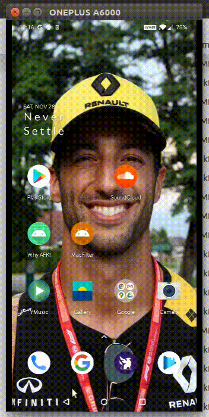

# youtube-rabbit-hole 🐰

> I have this bad habit of wandering through the YouTube feed whenever am bored. I mean, I know it's not just me, 
almost all of us fell into the YouTube rabbit hole easily. This is an attempt to replace that habit with something good. ;)

## Output

## How does it work?

The logic is pretty simple (or dumb). 
- First, you should `Disable` the original `YouTube` app, 
- Then install the `Youtube-Rabbit-Hole (YRH)` app.

Since `YRH` got the same `YouTube` logo and name, whenever you click on `YouTube`,
you'll be treated with a useful app. (like Wikipedia, Quora, Google Books, etc).
 
I don't know if it will work. I am going to experiment with this on myself 😁. 

## Download 📥

- Download [APK](app/release/app-release.apk)

## Author 👍
- theapache64